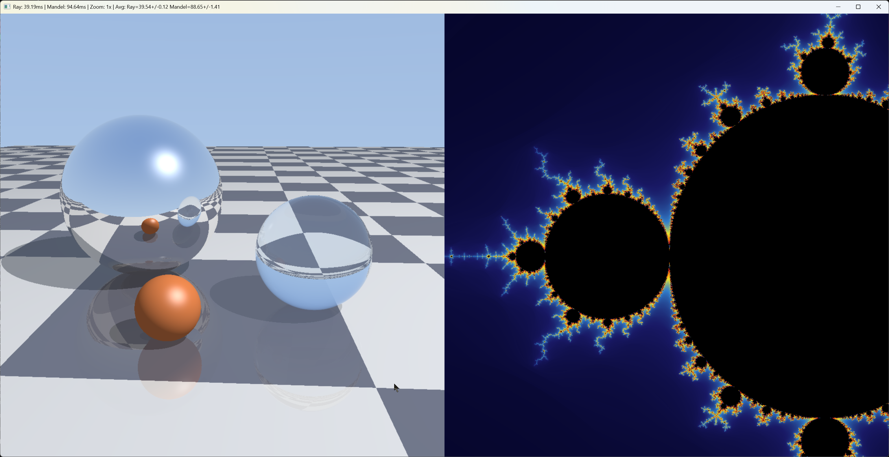

# ISPC Raytracing + Mandelbrot Demo

A real-time demonstration of two computationally intensive graphics algorithms implemented in [ISPC](https://ispc.github.io/) (Intel SPMD Program Compiler):

- **Left**: Whitted Raytracing (1979 classic scene)
- **Right**: Animated Mandelbrot zoom



*2048×1024 window. Raytracer renders once (~40ms), Mandelbrot animates (~90ms/frame on AVX2)*

---

## Quick Start

### Prerequisites
- Windows 10/11
- Visual Studio 2022 (for `cl.exe`)
- [ISPC compiler](https://ispc.github.io/downloads.html) (extract to project folder as `ispc-v1.30.0-windows/`)

### Build (PowerShell)

```powershell
# ISPC compile
.\ispc-v1.30.0-windows\bin\ispc.exe raytracer.ispc -o raytracer_ispc.obj -h raytracer_ispc.h --target=avx2

# C++ compile (run from VS Developer PowerShell)
cl /nologo /EHsc /O2 main.cpp raytracer_ispc.obj user32.lib gdi32.lib /Fe:demo.exe
```

### Run

```
.\demo.exe
```

Press **Escape** to close.

---

## ISPC Parallelization

### What is ISPC?

ISPC is a compiler for a variant of C that generates highly efficient SIMD code. It uses the **SPMD** (Single Program, Multiple Data) model: you write scalar-looking code, and ISPC compiles it to run across SIMD lanes.

### The `foreach` Construct

The key to ISPC's parallelization is `foreach`, which distributes iterations across SIMD lanes:

```c
foreach (py = 0 ... height, px = 0 ... width) {
    // This body executes for 8 pixels simultaneously on AVX2
    // (4 on SSE, 16 on AVX-512)
    Vec3 color = trace_ray(ray, depth);
    pixels[py * width + px] = pack_color(color);
}
```

On AVX2, each iteration processes **8 pixels in parallel** using 256-bit SIMD registers.

### Uniform vs Varying

ISPC distinguishes between:

| Type | Description | Example |
|------|-------------|---------|
| `uniform` | Same value across all SIMD lanes | Image dimensions, time, constants |
| `varying` | Different value per lane | Pixel coordinates, ray directions, colors |

```c
export void render_whitted(
    uniform uint32 pixels[],    // uniform: one pointer for all lanes
    uniform int width,          // uniform: shared by all lanes
    uniform int height
) {
    uniform float fov = 1.0f;   // uniform: same for all pixels

    foreach (py = 0 ... height, px = 0 ... width) {
        float u = (float)px / width;   // varying: different per pixel
        float v = (float)py / height;  // varying: different per pixel
        Vec3 color = trace_ray(...);   // varying: different result per pixel
    }
}
```

The compiler automatically:
- Keeps `uniform` values in scalar registers
- Spreads `varying` values across SIMD lanes
- Generates masked operations for divergent control flow

### ISPC-Specific Optimizations in This Code

#### 1. Struct-of-Arrays for Vector Math

ISPC handles structs efficiently, but our `Vec3` struct naturally maps to SIMD:

```c
struct Vec3 {
    float x, y, z;  // Each becomes a varying (8 floats on AVX2)
};
```

When you have 8 rays in flight, `color.x` holds 8 x-components, `color.y` holds 8 y-components, etc.

#### 2. Inline Everything

All helper functions are `inline`, eliminating function call overhead and enabling the compiler to optimize across function boundaries:

```c
inline Vec3 vec3_add(Vec3 a, Vec3 b) {
    return make_vec3(a.x + b.x, a.y + b.y, a.z + b.z);
}
```

#### 3. Uniform Loop-Invariant Values

Scene constants are declared `static const uniform` to ensure they're computed once and shared:

```c
static const uniform float sphere1_radius = 1.0f;
static const uniform Vec3 sphere1_center = {-0.8f, 1.0f, 1.0f};
// ...
```

#### 4. Avoiding Divergent Branches Where Possible

The raytracer has inherent divergence (different rays hit different objects), but we minimize it by:
- Testing all objects for all rays (no early-out that would cause divergence)
- Using the same recursion depth for all rays
- Letting ISPC's masked execution handle material-specific shading

#### 5. Double Precision for Mandelbrot

ISPC supports `double` for when precision matters:

```c
foreach (py = 0 ... height, px = 0 ... width) {
    double x0 = center_x + ((double)px - (double)width * 0.5) * scale;
    double y0 = center_y + ((double)py - (double)height * 0.5) * scale;

    double x = 0.0, y = 0.0;
    double x2 = 0.0, y2 = 0.0;  // Cache x² and y² (see Mandelbrot section)
    // ...
}
```

AVX2 provides 4-wide double SIMD (vs 8-wide float), so Mandelbrot runs at half the parallelism but with full 64-bit precision.

### Performance Characteristics

| Renderer | Time/Frame | SIMD Width | Notes |
|----------|------------|------------|-------|
| Raytracer | ~40ms | 8 (float) | Recursion overhead, divergent execution across lanes |
| Mandelbrot | ~90ms | 4 (double) | High iteration counts, half SIMD width |

The raytracer is faster despite being more complex because:
1. Float (8-wide) vs double (4-wide) SIMD
2. Fixed recursion depth (5) vs variable iterations (200–800)
3. Most rays terminate within 2–3 bounces; many Mandelbrot points iterate to max

### Compiling for Different Targets

```powershell
# SSE4 (128-bit, 4-wide float)
.\ispc.exe raytracer.ispc -o raytracer_ispc.obj --target=sse4-i32x4

# AVX2 (256-bit, 8-wide float) - default for modern CPUs
.\ispc.exe raytracer.ispc -o raytracer_ispc.obj --target=avx2-i32x8

# AVX-512 (512-bit, 16-wide float) - for Xeon/Ice Lake+
.\ispc.exe raytracer.ispc -o raytracer_ispc.obj --target=avx512skx-i32x16
```

---

## Whitted Raytracing

### Historical Context

Turner Whitted's 1980 paper *"An Improved Illumination Model for Shaded Display"* (published in Communications of the ACM, based on his 1979 work at Bell Labs) introduced **recursive raytracing** to computer graphics. This was revolutionary because it unified:

- **Reflection** - Mirror-like surfaces
- **Refraction** - Transparent materials like glass
- **Shadows** - By tracing rays toward light sources

The iconic image from Whitted's paper featured spheres on a checkerboard floor - one reflective, one refractive - which became the "hello world" of raytracing. Our implementation recreates this classic scene.

**Reference:** Whitted, T. (1980). "An Improved Illumination Model for Shaded Display." *Communications of the ACM*, 23(6), 343-349.

### Ray-Scene Intersection

The fundamental operation in raytracing is computing where a ray intersects scene geometry.

#### Ray Definition
```
Ray: origin + t * direction, where t > 0
```

#### Ray-Sphere Intersection

For a sphere centered at `C` with radius `r`, a point `P` is on the sphere if:
```
|P - C|² = r²
```

Substituting the ray equation `P = O + t*D`:
```
|O + t*D - C|² = r²
(O - C + t*D) · (O - C + t*D) = r²
```

Let `oc = O - C`, then:
```
t²(D·D) + 2t(oc·D) + (oc·oc - r²) = 0
```

This is a quadratic equation `at² + bt + c = 0` where:
- `a = D·D` (usually 1 if direction is normalized)
- `b = 2(oc·D)`
- `c = oc·oc - r²`

The discriminant `b² - 4ac` determines:
- **Negative**: Ray misses sphere
- **Zero**: Ray grazes sphere (one intersection)
- **Positive**: Ray pierces sphere (two intersections, take the smaller positive t)

```c
// Optimized: assumes normalized ray direction (a = 1), uses half_b to reduce operations
inline float intersect_sphere(Ray r, Vec3 center, float radius) {
    Vec3 oc = vec3_sub(r.origin, center);
    float half_b = vec3_dot(oc, r.dir);
    float c = vec3_dot(oc, oc) - radius * radius;
    float discriminant = half_b * half_b - c;

    if (discriminant < 0.0f) return -1.0f;

    float sqrt_disc = sqrt(discriminant);
    float t = -half_b - sqrt_disc;
    if (t > EPSILON_SHADOW) return t;

    t = -half_b + sqrt_disc;
    if (t > EPSILON_SHADOW) return t;

    return -1.0f;
}
```

#### Ray-Plane Intersection

For a horizontal floor at `y = floor_y`:
```
O.y + t * D.y = floor_y
t = (floor_y - O.y) / D.y
```

```c
inline float intersect_floor(Ray r) {
    if (abs(r.dir.y) < 0.0001f) return -1.0f;  // Ray parallel to floor
    float t = (floor_y - r.origin.y) / r.dir.y;
    return (t > 0.001f) ? t : -1.0f;
}
```

### Reflection

When a ray hits a reflective surface, it bounces according to the law of reflection:
```
R = I - 2(I·N)N
```

Where:
- `I` = incident ray direction
- `N` = surface normal
- `R` = reflected ray direction

```c
inline Vec3 vec3_reflect(Vec3 v, Vec3 n) {
    return vec3_sub(v, vec3_mul(n, 2.0f * vec3_dot(v, n)));
}
```

The reflected ray is then traced recursively to find what the mirror "sees."

### Refraction (Snell's Law)

When light passes between materials with different refractive indices, it bends according to Snell's Law:
```
n₁ sin(θ₁) = n₂ sin(θ₂)
```

Where:
- `n₁` = refractive index of first material (air ≈ 1.0)
- `n₂` = refractive index of second material (glass ≈ 1.5)
- `θ₁` = angle of incidence
- `θ₂` = angle of refraction

The refracted direction is computed by decomposing the ray into components parallel and perpendicular to the surface normal, then applying Snell's Law to the perpendicular component:

```c
inline bool refract(Vec3 v, Vec3 n, float ni_over_nt, Vec3 &refracted) {
    Vec3 uv = vec3_normalize(v);
    float dt = vec3_dot(uv, n);  // cos(θ₁)
    float discriminant = 1.0f - ni_over_nt * ni_over_nt * (1.0f - dt * dt);

    if (discriminant > 0.0f) {
        // Perpendicular component scaled by ratio, normal component from geometry
        refracted = vec3_sub(
            vec3_mul(vec3_sub(uv, vec3_mul(n, dt)), ni_over_nt),
            vec3_mul(n, sqrt(discriminant))
        );
        return true;
    }
    return false;  // Total internal reflection
}
```

When the discriminant is negative (sin²θ₂ > 1), **total internal reflection** occurs—the light cannot exit the denser medium at that angle and reflects instead.

### Fresnel Effect (Schlick Approximation)

Real glass both reflects and refracts light, with the ratio depending on the viewing angle. The Fresnel equations are complex, but Schlick's approximation works well:

```
R(θ) = R₀ + (1 - R₀)(1 - cos θ)⁵
```

Where `R₀ = ((n₁ - n₂) / (n₁ + n₂))²`

```c
inline float fresnel_schlick(float cos_theta, float n1, float n2) {
    float r0 = (n1 - n2) / (n1 + n2);
    r0 = r0 * r0;
    float x = 1.0f - cos_theta;
    return r0 + (1.0f - r0) * x * x * x * x * x;
}
```

At glancing angles (cos θ → 0), almost all light reflects. At perpendicular angles, most light refracts.

### Scene Setup

Our scene contains:

| Object | Position | Properties |
|--------|----------|------------|
| Mirror sphere | (-0.8, 1.0, 1.0), r=1.0 | Pure reflection, warm tint |
| Glass sphere | (1.2, 0.6, 0.0), r=0.6 | IOR 1.52 (crown glass), Fresnel reflection/refraction |
| Orange-red sphere | (-0.2, 0.3, -0.8), r=0.3 | Diffuse + specular |
| Floor | y = 0 | Checkerboard pattern, 15% reflective |
| Light | (8, 12, -4) | Point light for shadows |
| Camera | (0.5, 2.0, -4.5) | Looking at (0.2, 0.5, 1.0) |

### Recursive Tracing

The core algorithm traces rays recursively up to a maximum depth:

```c
inline Vec3 trace_ray(Ray r, int depth) {
    // Find closest intersection
    float closest_t = 1e10f;
    int hit_type = -1;

    // Test all objects...

    if (hit_type >= 0) {
        return shade_hit(r, closest_t, hit_type, depth);
    }

    // No hit - return sky color
    return sky_gradient(r.dir);
}
```

The shading function handles each material type differently:
- **Mirror**: Trace reflected ray, tint result
- **Glass**: Blend refracted and reflected rays using Fresnel
- **Diffuse**: Compute lighting with shadows

### Shadow Rays

To determine if a point is in shadow, we trace a ray toward the light:

```c
Ray shadow_ray = make_ray(hit_point + normal * 0.001f, to_light);
float shadow = 1.0f;

if (intersect_sphere(shadow_ray, sphere1_center, sphere1_radius) > 0.0f)
    shadow = 0.25f;  // In shadow of opaque sphere
else if (intersect_sphere(shadow_ray, sphere2_center, sphere2_radius) > 0.0f)
    shadow = 0.6f;   // Partial shadow through glass
```

**Implementation notes:**
- The 0.001 offset avoids self-intersection artifacts while remaining small relative to scene scale
- Shadow attenuation values (0.25 for opaque, 0.6 for glass) are aesthetic choices—glass transmits more light than opaque surfaces

---

## Mandelbrot Set

### Mathematical Definition

The Mandelbrot set is the set of complex numbers `c` for which the iteration:
```
z_{n+1} = z_n² + c, starting with z_0 = 0
```

remains bounded (|z| ≤ 2) as n → ∞.

Points inside the set are colored black. Points outside are colored based on how quickly they escape (the **escape time** algorithm).

### Implementation

```c
foreach (py = 0 ... height, px = 0 ... width) {
    double x0 = center_x + (px - width/2) * scale;
    double y0 = center_y + (py - height/2) * scale;

    double x = 0.0, y = 0.0;
    double x2 = 0.0, y2 = 0.0;
    int iter = 0;

    // Optimized iteration: cache x² and y²
    while (x2 + y2 <= 4.0 && iter < max_iter) {
        y = 2.0 * x * y + y0;
        x = x2 - y2 + x0;
        x2 = x * x;
        y2 = y * y;
        iter++;
    }

    // Color based on iteration count...
}
```

**Optimizations**:
- We cache `x²` and `y²` to reduce multiplications from 6 to 4 per iteration (the naive approach computes `x*x` and `y*y` in both the escape test and the iteration)
- The escape condition `x² + y² > 4` is equivalent to `|z| > 2`

### Smooth Coloring

Basic escape-time coloring produces visible bands. For smooth gradients, we use the **continuous potential** method.

The key insight: the escape-time potential function converges asymptotically, and we can estimate the "fractional iteration" needed to reach exactly |z| = 2. Since |z_n| ≈ 2^(2^n) for large n outside the set, inverting gives:

```c
double log_zn = log(x2 + y2) * 0.5;           // ln|z|
double nu = log2(log2(|z|));                   // Conceptually
double smooth_iter = iter + 1.0 - nu;
```

The actual code uses precomputed 1/ln(2) ≈ 1.4427 for efficiency:
```c
double nu = log(log_zn * 1.4426950408889634) * 1.4426950408889634;
```

This gives a fractional iteration count that varies continuously across the image, eliminating banding artifacts.

### Color Palette

We use a fire/plasma palette that cycles through:
```
Dark blue → Blue → Cyan → Yellow → Orange → Red → Dark
```

```c
inline Vec3 palette(float t) {
    t = clamp(t, 0.0f, 1.0f);

    if (t < 0.16f)      // Dark blue to blue
        return vec3_lerp(make_vec3(0,0,0.1), make_vec3(0.1,0.1,0.4), t/0.16);
    else if (t < 0.33f) // Blue to cyan
        return vec3_lerp(make_vec3(0.1,0.1,0.4), make_vec3(0.2,0.5,0.8), (t-0.16)/0.17);
    else if (t < 0.5f)  // Cyan to yellow
        return vec3_lerp(make_vec3(0.2,0.5,0.8), make_vec3(0.9,0.9,0.2), (t-0.33)/0.17);
    else if (t < 0.67f) // Yellow to orange
        return vec3_lerp(make_vec3(0.9,0.9,0.2), make_vec3(1.0,0.5,0.0), (t-0.5)/0.17);
    else if (t < 0.83f) // Orange to red
        return vec3_lerp(make_vec3(1.0,0.5,0.0), make_vec3(0.8,0.1,0.1), (t-0.67)/0.16);
    else                // Red to dark
        return vec3_lerp(make_vec3(0.8,0.1,0.1), make_vec3(0.2,0.0,0.0), (t-0.83)/0.17);
}
```

### Zoom Animation

The animation zooms into (-0.761574, -0.0847596), a point on the Mandelbrot set boundary with infinite self-similar detail. This coordinate comes from [Paul Bourke's Mandelbrot page](https://paulbourke.net/fractals/mandelbrot/).

```c
double zoom = 1.0;
double zoom_speed = 1.02;  // 2% per frame (smooth perceived motion)
double max_zoom = 78125.0; // 5^7, near double-precision limit for this region

// Each frame:
if (zooming_in) {
    zoom *= zoom_speed;
    if (zoom >= max_zoom) zooming_in = false;
} else {
    zoom /= zoom_speed;
    if (zoom <= 1.0) zooming_in = true;
}
```

The max zoom of 78125× is chosen to stay within double-precision limits while revealing fine structure. Beyond ~10^14× zoom, arbitrary-precision arithmetic would be needed.

### Why Double Precision?

At high zoom levels, single-precision float (32-bit) runs out of precision:
- Float provides ~7 significant decimal digits
- At 78125× zoom near coordinate -0.76, we're resolving features ~3×10⁻⁵ units wide
- This requires ~10 significant digits (5 for the coordinate, 5 for the detail)
- Double (64-bit) provides ~15 digits, sufficient for our zoom range

For deeper zooms (>10^14×), arbitrary-precision arithmetic would be needed.

---

## GDI Coordinate System

Understanding the coordinate system is essential for correctly mapping camera rays to screen pixels.

### The Problem

Windows GDI with a top-down DIB (`biHeight < 0`) has:
- Row 0 = top of screen
- Row increases going down

But our camera's "up" direction should point to the top of the screen.

### The Solution

We use a right-handed camera coordinate system with Y-up world coordinates:

```c
// World convention: Y is up
world_up = (0, 1, 0)
forward  = normalize(look_at - camera_pos)  // Camera's viewing direction

// Camera basis vectors (right-handed)
right  = cross(world_up, forward)   // Points to camera's right
cam_up = cross(forward, right)      // Points to camera's up (orthogonal to forward)

// Pixel to ray mapping
u = (px/width - 0.5) * aspect * fov   // -0.5 at left, +0.5 at right
v = (0.5 - py/height) * fov           // +0.5 at top, -0.5 at bottom
```

**Key insight**: Since `py=0` is the TOP of the screen in GDI, we use `v = (0.5 - py/height)` so that v is **positive** at the top. Positive v adds the up-vector to the ray direction, pointing rays upward to hit the sky.

---

## Development Screenshots

### Version 1

*Initial version: upside down, two spheres, small black/white checkerboard, flat sky, no specular highlights, no gamma correction, purple Mandelbrot palette*

### Version 2

*Improved scene (still upside down): added orange sphere, larger blue-gray checkerboard, sky gradient, specular highlights, gamma correction, warm mirror tint, cyan glass tint, floor reflections, soft shadows, fire Mandelbrot palette*

### Final Version

*Fixed orientation (sky at top), all v2 improvements retained. The GDI coordinate fix (`v = 0.5 - py/height`) ensures rays point upward at screen top.*

---

## File Structure

```
├── raytracer.ispc      # ISPC source (raytracer + Mandelbrot)
├── main.cpp            # Win32 window, timing, animation loop
├── raytracer_v1.ispc   # Backup of first working version
├── main_v1.cpp         # Backup of first working version
├── screenshot_*.png    # Screenshots for documentation
├── CLAUDE.md           # Brief build instructions
└── README.md           # This file
```

---

## References

1. Whitted, T. (1980). "An Improved Illumination Model for Shaded Display." *Communications of the ACM*, 23(6), 343-349. https://doi.org/10.1145/358876.358882

2. Schlick, C. (1994). "An Inexpensive BRDF Model for Physically-based Rendering." *Computer Graphics Forum*, 13(3), 233-246.

3. Mandelbrot, B. (1980). "Fractal aspects of the iteration of z → λz(1-z) for complex λ and z." *Annals of the New York Academy of Sciences*, 357(1), 249-259.

4. Bourke, P. "The Mandelbrot Set." https://paulbourke.net/fractals/mandelbrot/ (zoom target coordinates)

5. Pharr, M., Jakob, W., & Humphreys, G. (2016). *Physically Based Rendering: From Theory to Implementation* (3rd ed.). Morgan Kaufmann.

6. Intel ISPC User's Guide. https://ispc.github.io/ispc.html

---

## License

Public domain / CC0. Do whatever you want with it.
