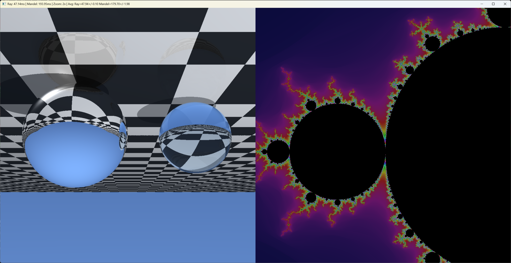
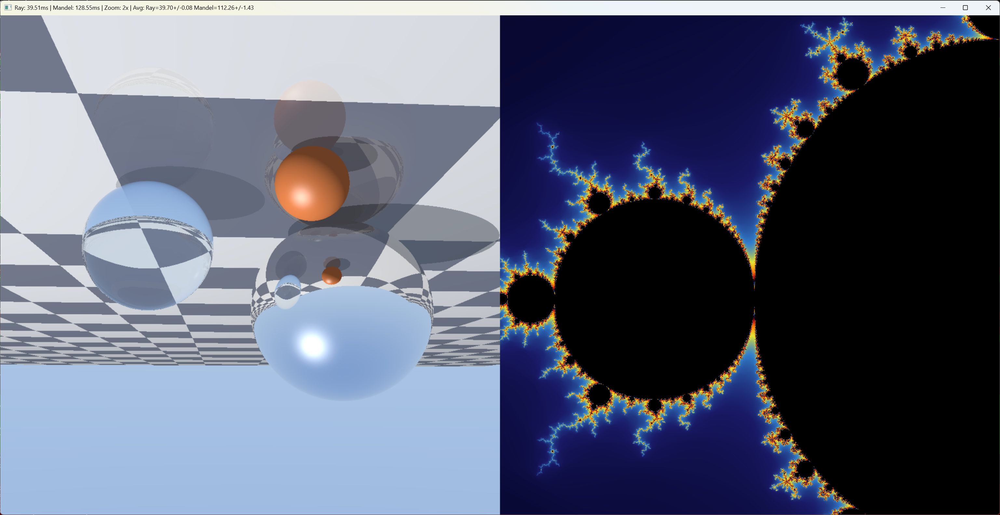

# ISPC Raytracing + Mandelbrot Demo: Technical Summary

## Screenshots

### Version 1 (Initial Implementation)


*Initial version showing upside-down raytracing (left) and Mandelbrot set (right). Note the sky appears at the bottom due to incorrect camera coordinate handling.*

### Version 2 (Fixed Orientation)


*Fixed version with correct orientation. Raytracer shows sky at top, checkerboard floor below, with three spheres. Mandelbrot displays the classic set with fire/plasma coloring.*

---

## Overview

This project demonstrates two computationally intensive graphics algorithms implemented in ISPC (Intel SPMD Program Compiler):

1. **Whitted Raytracing** - The foundational recursive raytracing algorithm from 1979
2. **Mandelbrot Set** - The famous fractal with animated zoom

Both run in parallel using ISPC's SPMD (Single Program, Multiple Data) model, achieving significant speedups over scalar C++ code.

---

## Part 1: Whitted Raytracing

### Historical Context

Turner Whitted's 1980 paper *"An Improved Illumination Model for Shaded Display"* (published in Communications of the ACM, based on his 1979 work at Bell Labs) introduced **recursive raytracing** to computer graphics. This was revolutionary because it unified:

- **Reflection** - Mirror-like surfaces
- **Refraction** - Transparent materials like glass
- **Shadows** - By tracing rays toward light sources

The iconic image from Whitted's paper featured spheres on a checkerboard floor - one reflective, one refractive - which became the "hello world" of raytracing. Our implementation recreates this classic scene.

**Reference:** Whitted, T. (1980). "An Improved Illumination Model for Shaded Display." *Communications of the ACM*, 23(6), 343-349.

### Ray-Scene Intersection

The fundamental operation in raytracing is computing where a ray intersects scene geometry.

#### Ray Definition
```
Ray: origin + t * direction, where t > 0
```

#### Ray-Sphere Intersection

For a sphere centered at `C` with radius `r`, a point `P` is on the sphere if:
```
|P - C|² = r²
```

Substituting the ray equation `P = O + t*D`:
```
|O + t*D - C|² = r²
(O - C + t*D) · (O - C + t*D) = r²
```

Let `oc = O - C`, then:
```
t²(D·D) + 2t(oc·D) + (oc·oc - r²) = 0
```

This is a quadratic equation `at² + bt + c = 0` where:
- `a = D·D` (usually 1 if direction is normalized)
- `b = 2(oc·D)`
- `c = oc·oc - r²`

The discriminant `b² - 4ac` determines:
- **Negative**: Ray misses sphere
- **Zero**: Ray grazes sphere (one intersection)
- **Positive**: Ray pierces sphere (two intersections, take the smaller positive t)

```c
inline float intersect_sphere(Ray r, Vec3 center, float radius) {
    Vec3 oc = vec3_sub(r.origin, center);
    float a = vec3_dot(r.dir, r.dir);
    float b = 2.0f * vec3_dot(oc, r.dir);
    float c = vec3_dot(oc, oc) - radius * radius;
    float discriminant = b * b - 4.0f * a * c;

    if (discriminant < 0.0f) return -1.0f;

    float t = (-b - sqrt(discriminant)) / (2.0f * a);
    if (t > 0.001f) return t;  // Small epsilon to avoid self-intersection

    t = (-b + sqrt(discriminant)) / (2.0f * a);
    if (t > 0.001f) return t;

    return -1.0f;
}
```

#### Ray-Plane Intersection

For a horizontal floor at `y = floor_y`:
```
O.y + t * D.y = floor_y
t = (floor_y - O.y) / D.y
```

```c
inline float intersect_floor(Ray r) {
    if (abs(r.dir.y) < 0.0001f) return -1.0f;  // Ray parallel to floor
    float t = (floor_y - r.origin.y) / r.dir.y;
    return (t > 0.001f) ? t : -1.0f;
}
```

### Reflection

When a ray hits a reflective surface, it bounces according to the law of reflection:
```
R = I - 2(I·N)N
```

Where:
- `I` = incident ray direction
- `N` = surface normal
- `R` = reflected ray direction

```c
inline Vec3 vec3_reflect(Vec3 v, Vec3 n) {
    return vec3_sub(v, vec3_mul(n, 2.0f * vec3_dot(v, n)));
}
```

The reflected ray is then traced recursively to find what the mirror "sees."

### Refraction (Snell's Law)

When light passes between materials with different refractive indices, it bends according to Snell's Law:
```
n₁ sin(θ₁) = n₂ sin(θ₂)
```

Where:
- `n₁` = refractive index of first material (air ≈ 1.0)
- `n₂` = refractive index of second material (glass ≈ 1.5)
- `θ₁` = angle of incidence
- `θ₂` = angle of refraction

The refracted direction is computed as:
```c
inline bool refract(Vec3 v, Vec3 n, float ni_over_nt, Vec3 &refracted) {
    Vec3 uv = vec3_normalize(v);
    float dt = vec3_dot(uv, n);
    float discriminant = 1.0f - ni_over_nt * ni_over_nt * (1.0f - dt * dt);

    if (discriminant > 0.0f) {
        refracted = vec3_sub(
            vec3_mul(vec3_sub(uv, vec3_mul(n, dt)), ni_over_nt),
            vec3_mul(n, sqrt(discriminant))
        );
        return true;
    }
    return false;  // Total internal reflection
}
```

When the discriminant is negative, **total internal reflection** occurs - the light cannot exit the denser medium at that angle and reflects instead.

### Fresnel Effect (Schlick Approximation)

Real glass both reflects and refracts light, with the ratio depending on the viewing angle. The Fresnel equations are complex, but Schlick's approximation works well:

```
R(θ) = R₀ + (1 - R₀)(1 - cos θ)⁵
```

Where `R₀ = ((n₁ - n₂) / (n₁ + n₂))²`

```c
inline float fresnel_schlick(float cos_theta, float n1, float n2) {
    float r0 = (n1 - n2) / (n1 + n2);
    r0 = r0 * r0;
    float x = 1.0f - cos_theta;
    return r0 + (1.0f - r0) * x * x * x * x * x;
}
```

At glancing angles (cos θ → 0), almost all light reflects. At perpendicular angles, most light refracts.

### Scene Setup

Our scene contains:

| Object | Position | Properties |
|--------|----------|------------|
| Mirror sphere | (-0.8, 1.0, 1.0), r=1.0 | Pure reflection, warm tint |
| Glass sphere | (1.2, 0.6, 0.0), r=0.6 | IOR 1.52, Fresnel reflection/refraction |
| Orange sphere | (-0.2, 0.3, -0.8), r=0.3 | Diffuse + specular |
| Floor | y = 0 | Checkerboard pattern, 15% reflective |
| Light | (8, 12, -4) | Point light for shadows |
| Camera | (0.5, 2.0, -4.5) | Looking at (0.2, 0.5, 1.0) |

### Recursive Tracing

The core algorithm traces rays recursively up to a maximum depth:

```c
inline Vec3 trace_ray(Ray r, int depth) {
    // Find closest intersection
    float closest_t = 1e10f;
    int hit_type = -1;

    // Test all objects...

    if (hit_type >= 0) {
        return shade_hit(r, closest_t, hit_type, depth);
    }

    // No hit - return sky color
    return sky_gradient(r.dir);
}
```

The shading function handles each material type differently:
- **Mirror**: Trace reflected ray, tint result
- **Glass**: Blend refracted and reflected rays using Fresnel
- **Diffuse**: Compute lighting with shadows

### Shadow Rays

To determine if a point is in shadow, we trace a ray toward the light:

```c
Ray shadow_ray = make_ray(hit_point + normal * 0.001f, to_light);
float shadow = 1.0f;

if (intersect_sphere(shadow_ray, sphere1_center, sphere1_radius) > 0.0f)
    shadow = 0.25f;  // In shadow of opaque sphere
else if (intersect_sphere(shadow_ray, sphere2_center, sphere2_radius) > 0.0f)
    shadow = 0.6f;   // Partial shadow through glass
```

---

## Part 2: Mandelbrot Set

### Mathematical Definition

The Mandelbrot set is the set of complex numbers `c` for which the iteration:
```
z_{n+1} = z_n² + c, starting with z_0 = 0
```

remains bounded (|z| ≤ 2) as n → ∞.

Points inside the set are colored black. Points outside are colored based on how quickly they escape (the **escape time** algorithm).

### Implementation

```c
foreach (py = 0 ... height, px = 0 ... width) {
    double x0 = center_x + (px - width/2) * scale;
    double y0 = center_y + (py - height/2) * scale;

    double x = 0.0, y = 0.0;
    double x2 = 0.0, y2 = 0.0;
    int iter = 0;

    // Optimized iteration: cache x² and y²
    while (x2 + y2 <= 4.0 && iter < max_iter) {
        y = 2.0 * x * y + y0;
        x = x2 - y2 + x0;
        x2 = x * x;
        y2 = y * y;
        iter++;
    }

    // Color based on iteration count...
}
```

**Optimization**: We cache `x²` and `y²` to avoid redundant multiplications. The escape condition `x² + y² > 4` is equivalent to `|z| > 2`.

### Smooth Coloring

Basic escape-time coloring produces visible bands. For smooth gradients, we use the **continuous potential** method:

```c
double log_zn = log(x2 + y2) * 0.5;
double nu = log(log_zn / log(2)) / log(2);
double smooth_iter = iter + 1.0 - nu;
```

This gives a fractional iteration count that varies smoothly across the image.

### Color Palette

We use a fire/plasma palette that cycles through:
```
Dark blue → Blue → Cyan → Yellow → Orange → Red → Dark
```

```c
inline Vec3 palette(float t) {
    t = clamp(t, 0.0f, 1.0f);

    if (t < 0.16f)      // Dark blue to blue
        return lerp(vec3(0,0,0.1), vec3(0.1,0.1,0.4), t/0.16);
    else if (t < 0.33f) // Blue to cyan
        return lerp(vec3(0.1,0.1,0.4), vec3(0.2,0.5,0.8), (t-0.16)/0.17);
    // ... etc
}
```

### Zoom Animation

The animation zooms into the point (-0.761574, -0.0847596), which lies on the boundary of the Mandelbrot set and contains infinite detail.

```c
double zoom = 1.0;
double zoom_speed = 1.02;  // 2% per frame
double max_zoom = 78125.0;

// Each frame:
if (zooming_in) {
    zoom *= zoom_speed;
    if (zoom >= max_zoom) zooming_in = false;
} else {
    zoom /= zoom_speed;
    if (zoom <= 1.0) zooming_in = true;
}
```

### Why Double Precision?

At high zoom levels, single-precision float (32-bit) runs out of precision:
- Float has ~7 decimal digits of precision
- At 78125x zoom, we need ~log₁₀(78125) ≈ 5 extra digits
- Double (64-bit) provides ~15 digits, sufficient for our zoom range

For deeper zooms (>10^14), arbitrary precision arithmetic would be needed.

---

## Part 3: ISPC Parallelization

### SPMD Model

ISPC uses the SPMD (Single Program, Multiple Data) model. The `foreach` construct automatically distributes work across SIMD lanes:

```c
foreach (py = 0 ... height, px = 0 ... width) {
    // This body executes for multiple pixels simultaneously
    // using AVX2's 8-wide float SIMD
}
```

On AVX2, this processes 8 pixels in parallel per iteration.

### Uniform vs Varying

ISPC distinguishes between:
- **uniform**: Same value across all SIMD lanes (scalars, loop-invariant data)
- **varying**: Different value per lane (pixel coordinates, computed colors)

```c
export void render_whitted(uniform uint32 pixels[],   // uniform pointer
                           uniform int width,          // uniform scalar
                           uniform int height,
                           uniform float time) {
    foreach (py = 0 ... height, px = 0 ... width) {
        float u = ...;  // varying - different per pixel
        float v = ...;  // varying
        Vec3 color = trace_ray(...);  // varying result
    }
}
```

### Performance Characteristics

| Renderer | Time per Frame | Notes |
|----------|----------------|-------|
| Raytracer | ~40ms | Limited by recursion depth, divergent branches |
| Mandelbrot | ~110-130ms | Limited by iteration count, double precision |

The raytracer is faster despite being more complex because:
1. Fixed recursion depth (5) vs variable Mandelbrot iterations (200-800)
2. Float vs double arithmetic
3. Most rays hit something quickly; many Mandelbrot points iterate to max

---

## Part 4: GDI Coordinate System

### The Problem

Windows GDI with a top-down DIB (`biHeight < 0`) has:
- Row 0 = top of screen
- Row increases going down

But our camera's "up" direction should point to the top of the screen.

### The Solution

For a right-handed camera coordinate system:

```c
// Camera basis vectors
right  = cross(world_up, forward)   // Points to camera's right
cam_up = cross(forward, right)      // Points to camera's up

// Pixel to ray mapping
u = (px/width - 0.5) * aspect * fov   // -0.5 at left, +0.5 at right
v = (0.5 - py/height) * fov           // +0.5 at top, -0.5 at bottom
```

**Key insight**: Since `py=0` is the TOP of the screen in GDI, we use `v = (0.5 - py/height)` so that v is **positive** at the top. Positive v adds the up-vector to the ray direction, pointing rays upward to hit the sky.

---

## File Structure

```
test-ispc/
├── raytracer.ispc      # ISPC source: raytracer + Mandelbrot
├── main.cpp            # Win32 window, timing, animation
├── raytracer_ispc.h    # Auto-generated ISPC header
├── raytracer_ispc.obj  # Compiled ISPC object
├── gradient.exe        # Final executable
├── CLAUDE.md           # Build instructions
├── summary.md          # This file
├── raytracer_v1.ispc   # Backup: first working version
├── main_v1.cpp         # Backup: first working version
└── ispc-v1.30.0-windows/  # ISPC compiler
```

---

## References

1. Whitted, T. (1980). "An Improved Illumination Model for Shaded Display." *Communications of the ACM*, 23(6), 343-349. https://doi.org/10.1145/358876.358882

2. Schlick, C. (1994). "An Inexpensive BRDF Model for Physically-based Rendering." *Computer Graphics Forum*, 13(3), 233-246.

3. Mandelbrot, B. (1980). "Fractal aspects of the iteration of z → λz(1-z) for complex λ and z." *Annals of the New York Academy of Sciences*, 357(1), 249-259.

4. Pharr, M., Jakob, W., & Humphreys, G. (2016). *Physically Based Rendering: From Theory to Implementation* (3rd ed.). Morgan Kaufmann.

5. Intel ISPC Documentation. https://ispc.github.io/

---

## Building and Running

```powershell
cd C:\Users\mv2\Dropbox\Claude\test-ispc

# Compile ISPC
.\ispc-v1.30.0-windows\bin\ispc.exe raytracer.ispc -o raytracer_ispc.obj -h raytracer_ispc.h --target=avx2

# Compile C++ (in VS Developer PowerShell)
cl /nologo /EHsc /O2 main.cpp raytracer_ispc.obj user32.lib gdi32.lib /Fe:gradient.exe

# Run
.\gradient.exe
```

Press Escape to close.
